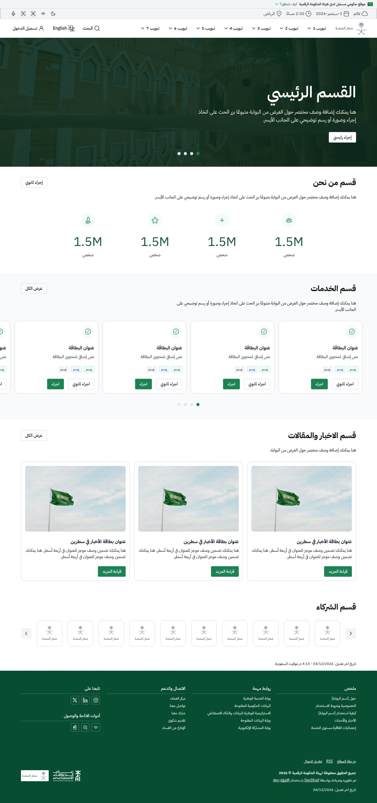
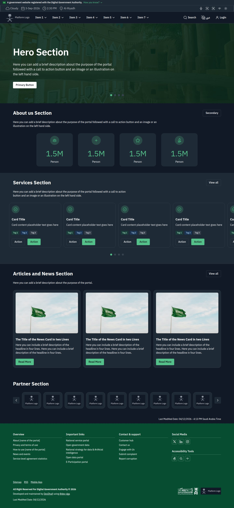

# dev-dga templates · قوالب كود المنصات

The DGA Platforms Code page templates, built as React pages from
[`@dev-dga`](https://dev-dga-hub.vercel.app) components and nothing else. Arabic (default) and
English, RTL-native, light and dark. The first template is the **Home Page Template**; the Service
Page and Form templates from the same Figma collection follow in this repo.

**Live demo:** [dev-dga-templates.vercel.app](https://dev-dga-templates.vercel.app)

> Independent and community-maintained. Not affiliated with or endorsed by the Digital Government
> Authority (DGA). The copy, photo, and logo placeholders are the template's own demo assets,
> reproduced as drawn.

عرض توضيحي مستقل لقوالب كود المنصات، مبني بالكامل بمكوّنات `@dev-dga`. القالب الأول: الصفحة
الرئيسية. عربي (افتراضي) وإنجليزي، بوضع فاتح وداكن. غير تابع لهيئة الحكومة الرقمية.

<p>
  
  
</p>

The [mobile rendering at 430px](docs/screenshots/home-ar-mobile-light.jpg) follows the template's
mobile frame.

## What this repo shows

The DGA publishes the Platforms Code design system as Figma files. `@dev-dga` implements its
components in React. This repo takes the official page templates and builds them with those
components alone: no custom components, no component restyling, only content and Tailwind utility
classes for page layout. Each section matches its Figma frame at 1440px and 430px in both locales.

Each template lives at its own path under the locale:

| Template  | Arabic     | English    |
| --------- | ---------- | ---------- |
| Home page | `/ar/home` | `/en/home` |

You can use the repo in any of the following ways:

- As a starting point for a government portal home page. Replace the copy and the images and keep
  the sections you need.
- As a worked example of composing `@dev-dga` components into a full page: a header with a search
  panel and a drawer, a hero carousel, card grids, a partner carousel, and a footer.
- As a conformance check on the library. Any gap between the frames and the page is a library issue,
  not a page issue.

## Quick start

You need Node.js 22 or later and pnpm.

```bash
pnpm install
pnpm dev
```

The dev server listens on `http://localhost:5173` and redirects to `/ar/home`. English is at
`/en/home`.

The following scripts are available:

| Script              | Purpose                                      |
| ------------------- | -------------------------------------------- |
| `pnpm dev`          | Vite dev server                              |
| `pnpm build`        | Type-check and production build into `dist/` |
| `pnpm preview`      | Serve the production build locally           |
| `pnpm typecheck`    | `tsc -b`                                     |
| `pnpm lint`         | ESLint                                       |
| `pnpm format:check` | Prettier                                     |

To deploy, serve `dist/` as a static site with every path rewritten to `index.html`, because the
locale routes are client-side.

## Sections

The following table lists each section of the template and the library components that build it.

| Section                                    | Library components                                                      |
| ------------------------------------------ | ----------------------------------------------------------------------- |
| Digital stamp                              | `DigitalStamp` with Arabic and English strings                          |
| Utility strip (optional second nav header) | `Button` + `Tooltip`, including the theme toggle                        |
| Header, sub-menu, mobile drawer            | `Header` family, `SearchBox`, `Chip`, `SlideoutMenu` family             |
| Hero                                       | `Carousel` (dots) + `Button onColor`                                    |
| About                                      | `Card align="center"` + `CardIcon featured size="lg"`                   |
| Services                                   | `Carousel slideSize="320px" align="center"` + `Card` + `Tag` + `Button` |
| News and articles                          | `Card` + `CardImage`; a peeking `Carousel` at 430px                     |
| Partners                                   | `Carousel arrowStyle="neutral"` (overlay arrows at 430px) + `Card`      |
| Last modified date                         | Text line (the frame's feedback section is the date only)               |
| Footer                                     | `Footer` family (dark green) + `Button` icon buttons                    |

## How it's built

- **Components:** every UI element is a `@dev-dga/react` component, styled by `@dev-dga/css`. When
  a section needs something the library lacks, the fix goes into the library, not into this repo.
- **Layout:** Tailwind CSS v4 utility classes on the library's tokens. `src/styles/globals.css`
  imports the library's Tailwind bridge, `@dev-dga/css/tailwind.css`, which maps every `@dev-dga`
  token into the Tailwind theme, and defines one utility, `hp-container`, for the 1280px content
  width and the frame gutters. Tailwind's own color, type, and radius scales are disabled first,
  so every color and type size on the page resolves to a library token.
- **Locales:** the URL sets the locale (`/ar`, `/en`), and the text direction follows it. All copy
  lives in `src/i18n/copy.ts`. English is the type source and Arabic mirrors it. Both are the
  template's verbatim placeholder strings.
- **Theme:** light is the default. The moon or sun button in the utility strip switches themes, and
  the choice persists in `localStorage` under the `hp-mode` key.
- **Routing:** a react-router data router. `/` and `/ar` redirect to `/ar/home`, an unknown locale
  redirects to `/ar`, and unknown paths render a not-found page.

The following tree shows where things live:

```text
src/
  app/        routes, locale layout, providers, theme mode
  assets/     inline SVG icons and the logo placeholders
  hooks/      media-query hook
  i18n/       locale helpers and the typed copy dictionary (en, ar)
  pages/      HomePage and NotFoundPage
  sections/   one component per section of the home page template
  styles/     globals.css, the Tailwind entry
public/images/  the template's exported assets
docs/spec/      the extracted spec: frames, node IDs, guidelines, library mapping
docs/reference/ Figma renders of the English frames at 1440 and 430
```

## Adapt it to your portal

To turn the home page template into a real home page, follow these steps:

1. Replace the strings in `src/i18n/copy.ts`. The dictionary is typed, so a missing key in either
   locale fails the build.
2. Replace the files in `public/images/`: the hero photo, the news photo, the logo placeholder at 32,
   48, and 64px, and the Year of AI mark. Keep the file names or update the paths in the sections.
3. Set your brand color on the `DgaProvider` in `src/app/providers.tsx` with its `theme` prop. It
   accepts a palette name or a CSS color, and the library derives the hover and active shades.
4. Remove the sections you don't need from `src/pages/home/HomePage.tsx`.

## Design source and fidelity

The design is the
[Home Page Template - Platforms Code](https://www.figma.com/community/file/1412792257811427893/home-page-template-platforms-code)
file on Figma Community, published by the DGA. The page follows the Arabic desktop and mobile frames
with the image hero and the dark green footer. `docs/spec/home-page.md` records the frames, node IDs,
the 14 guidelines, and how each section maps to the library.

At 1440px and 430px, every Arabic section lands on its frame's height and offset. The English page
mirrors its frames except where Chromium sets a placeholder string a few pixels wider than Figma
does, which makes a few English cards one line taller.

## Known limitations

- The utility strip is hidden under 768px, as in the mobile frames, so the theme toggle isn't
  available on mobile.
- The "Platform Logo" label inside the logo placeholder is gray-500 on white, as drawn, and fails
  the WCAG AA contrast ratio. Replace the placeholder with your logo.
- The flag photo and the two marks are the template's demo assets. Replace them before you deploy a
  real portal.

## Issues

- Problems with this template: open an issue in this repo.
- Problems with a component: open an issue in
  [dev-dga-hub](https://github.com/DevDhaif/dev-dga-hub/issues), the library's public tracker.

## License

The code in this repo is licensed under the MIT license. See [LICENSE](LICENSE). The `@dev-dga`
packages are also MIT and install from npm.

The license doesn't cover the design or the demo assets. The Platforms Code design belongs to the
DGA and is shared on Figma Community under Figma's community terms. The photo, the palm-and-swords
logo placeholder, and the Year of AI mark belong to their owners and ship here only to reproduce the
template as published.

## Credits

- Design: [the DGA Platforms Code team](https://www.figma.com/community/file/1412792257811427893/home-page-template-platforms-code?q_id=8e25a96a-dd0a-434f-9e9d-b85ded32af1d).
- Library and template: [DevDhaif](https://www.linkedin.com/in/devdhaif), maintainer of
  [`@dev-dga`](https://dev-dga-hub.vercel.app).
